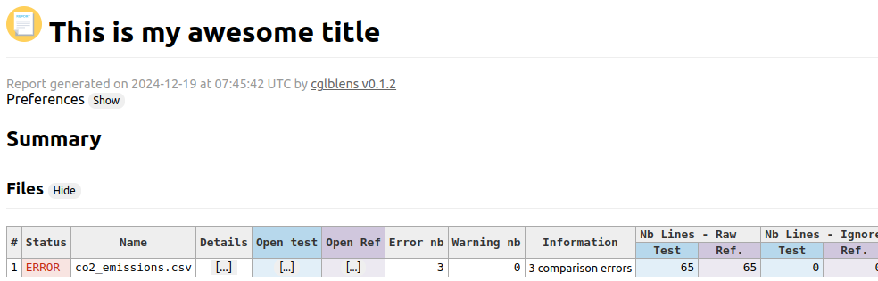

# Html Report Config

## Instructions

1. Go to 01_compare_csv `cd 10_report_html_config`
2. Test A - Run `cglblens run .`

## Explainations

This demo shows the html report diplay cutomization capabilities :

- title
- logo

